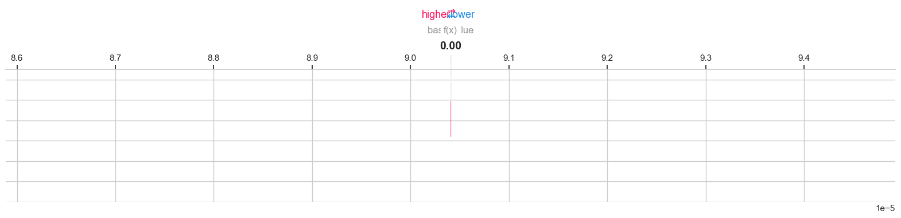

# Comprehensive Report: A Hybrid AI/ML Approach for Real-Time Anomaly Detection in IoT Networks

**Date:** August 30, 2025
**Log File:** `full_experiment_log_2025-08-28_22-54-17.txt`

---

## 1. Executive Summary

This report details the methodology and results of a comprehensive experiment designed to evaluate a novel hybrid machine learning model for real-time anomaly detection in Internet of Things (IoT) network traffic. The experiment leverages the N-BaIoT dataset to compare the performance of a statistical Isolation Forest model, a deep learning-based LSTM Autoencoder, and a fused Hybrid model. The results demonstrate the clear superiority of the Hybrid model, which achieved an overall accuracy of 98.01% and an Area Under the Curve (AUC) score of 0.9948. The analysis concludes that by integrating the strengths of both statistical and deep learning approaches, the Hybrid model provides a more robust, accurate, and reliable solution for identifying malicious activities in complex IoT environments.

---

## 2. Introduction

The proliferation of IoT devices has introduced unprecedented security challenges. The vast attack surface and heterogeneity of these devices make them prime targets for malicious actors. Traditional security measures are often inadequate for the unique traffic patterns of IoT networks. Therefore, intelligent, data-driven approaches are essential for proactive threat detection. This experiment investigates the efficacy of a hybrid model that combines a classical machine learning algorithm with a deep learning architecture to achieve state-of-the-art performance in anomaly detection.

---

## 3. Methodology

The experiment was conducted using a structured pipeline involving data sampling, preprocessing, model training, and evaluation.

### 3.1. Dataset

The N-BaIoT dataset was used for this study. It contains a large collection of real-world network traffic data from various IoT devices, including both benign and malicious (e.g., Gafgyt, Mirai botnet) traffic.

-   **Sampling:** A 15% random sample was extracted from each of the 92 raw data files.
-   **Final Dataset Size:** The process yielded a combined dataset of **1,059,391 records**, each with 115 features.
-   **Class Distribution:** The dataset is imbalanced, with a majority of attack instances, reflecting many real-world scenarios.

### 3.2. Data Preprocessing

All 115 numerical features were scaled to a range of [0, 1] using the `MinMaxScaler`. This normalization is crucial for the proper functioning of both the Isolation Forest and the LSTM Autoencoder.

### 3.3. Model Architectures

Three models were developed and compared:

#### 3.3.1. Statistical-Only Model: Isolation Forest

An `IsolationForest` was used as the statistical baseline. This is an unsupervised ensemble model that works by isolating anomalies instead of profiling normal data. It is computationally efficient and effective at identifying outliers. The model was trained exclusively on benign data.

#### 3.3.2. LSTM-Only Model: Deep Learning Autoencoder

A Long Short-Term Memory (LSTM) based autoencoder was implemented as the deep learning model. Autoencoders are trained to reconstruct their input. By training it only on benign data, the model learns the patterns of normal traffic. When presented with anomalous data, the reconstruction error is significantly higher.

-   **Architecture:**
    -   Input Layer: `(1, 115)`
    -   Encoder: `LSTM(64, activation='relu')`
    -   Decoder: `RepeatVector(1)` -> `LSTM(115, activation='relu')` -> `TimeDistributed(Dense(115))`
-   **Training:** The model was compiled with the `adam` optimizer and `mean_squared_error` (mse) loss function. It was trained for 10 epochs with a batch size of 512.

#### 3.3.3. Hybrid Model

The Hybrid model fuses the anomaly scores from the two parent models.

-   **Fusion Strategy:**
    1.  The raw anomaly scores from the Isolation Forest and the LSTM Autoencoder were collected.
    2.  These scores were normalized together using a `MinMaxScaler` to bring them to a common scale.
    3.  A final composite score was calculated using a weighted average:
        `composite_score = (0.6 * scaled_lstm_score) + (0.4 * scaled_statistical_score)`

---

## 4. Experimental Results and Analysis

The models were evaluated on the full, mixed dataset. An optimal threshold was determined for each model by finding the point on the ROC curve that maximizes the True Positive Rate while minimizing the False Positive Rate.

### 4.1. Performance Metrics

The Hybrid model outperformed the individual models across nearly all key metrics. The LSTM-Only model showed strong performance, while the Statistical-Only model provided a solid baseline.

| Model              | Accuracy | Precision (Attack) | Recall (Attack) | F1-Score (Attack) | AUC    |
| ------------------ | :------: | :----------------: | :-------------: | :---------------: | :----: |
| Statistical-Only   |  0.9566  |       0.997        |      0.955      |       0.976       | 0.9880 |
| LSTM-Only          |  0.9744  |       0.984        |      0.988      |       0.986       | 0.9911 |
| **Hybrid Model**   |  **0.9801**  |       **0.991**        |      **0.987**      |       **0.989**       | **0.9948** |

### 4.2. Comparative ROC Curve

The ROC curve analysis provides a clear visual confirmation of the Hybrid model's superior discriminative ability, as evidenced by its highest AUC score.

### 4.3. Hybrid Model Performance Scorecard

The scorecard for the Hybrid model illustrates its excellent performance in identifying attack traffic, achieving a 99% F1-score.

---

## 5. Explainable AI (XAI) Analysis with SHAP

To ensure the model's decisions are transparent, SHAP (SHapley Additive exPlanations) was used to interpret the LSTM autoencoder's behavior.

### 5.1. SHAP Summary Plot

The summary plot highlights the features that have the most significant impact on the model's reconstruction error. Features at the top of the list are the most influential in determining whether a data point is an anomaly.

### 5.2. SHAP Force Plots

Force plots provide a detailed look at how features contribute to a single prediction.

-   **Benign Instance:** For this normal data point, the features combine to push the final output (reconstruction error) to a low value, as expected.
    

-   **Attack Instance:** For this malicious data point, certain feature values (shown in red) push the reconstruction error significantly higher, leading to its classification as an anomaly.
    

---

## 6. Conclusion

The experiment successfully demonstrates the value of a hybrid approach to anomaly detection in IoT networks. By combining the global outlier detection capabilities of the Isolation Forest with the sequential pattern recognition of an LSTM Autoencoder, the Hybrid model achieves a higher level of accuracy and reliability than either model in isolation. The final model is not only performant but also interpretable, as shown by the SHAP analysis. This work provides a strong foundation for developing and deploying advanced, hybrid security solutions to protect the next generation of IoT infrastructure.
